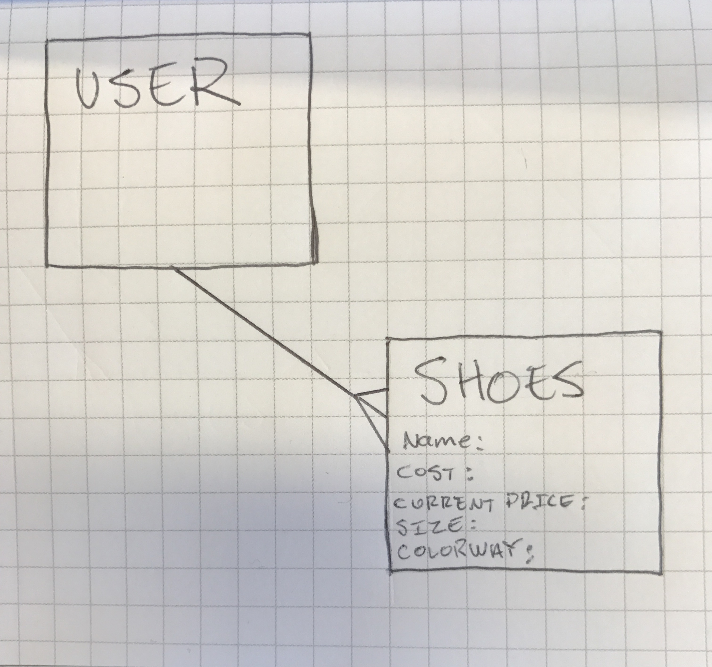
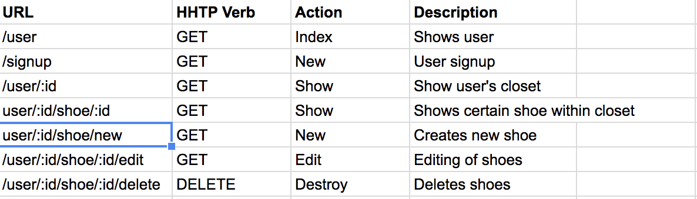

# Sneaker Closet

## Description
Creating your own sneaker closet: Users will have the ability to create their own "Closet" with sneakers they own. They will be able to add the name, cost, current price, colorway, size, and condition of each pair of sneakers they add to their closet. The perfect way for sneakerheads to show off their collections!

## Platform:
When a user signs in, they will have a form where they will create and name their closet. In that same form, the user will be able to add their sneakers with all the information of the sneakers. Users will be able to edit, add, and delete to their closet list.  

## Entity Relationship Diagram

## Routes

## Trello Link:
[Trello](https://trello.com/b/XgNUygrO/sneaker-closet-project-2)
